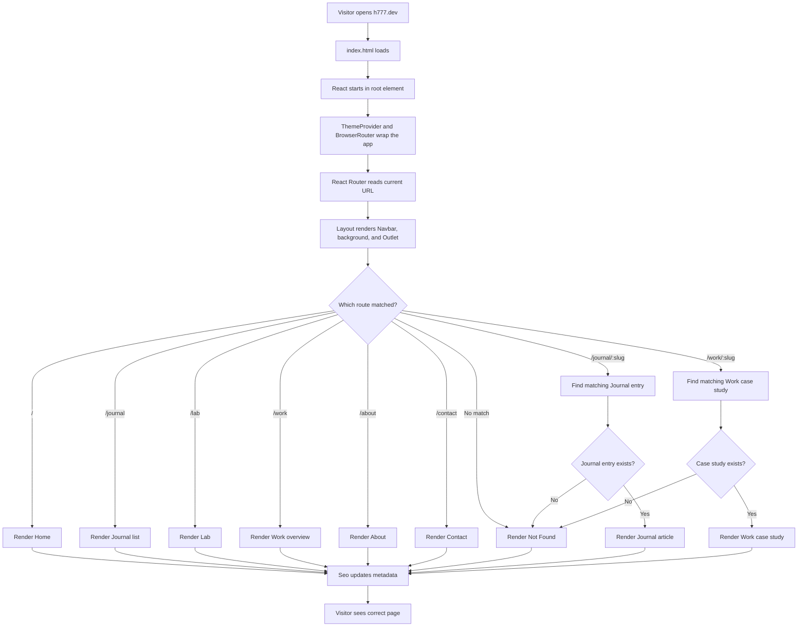
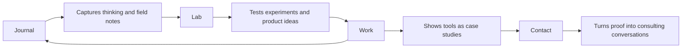

# Problem, Algorithm, Pseudocode, And Flowchart

This document explains the h777 portfolio project in a classic software-design
format: Problem -> Algorithm -> Pseudocode -> Flowchart.

Use it when you need to explain what the project does, how it works, and how
the main logic moves from a visitor opening the site to seeing the correct page.

## Problem

The project needs to present Carlos Sanchez's property management operations
work, field notes, experiments, and product case studies in a way that is easy
for humans to navigate and easy for search engines to understand.

The site must solve these smaller problems:

1. Show different pages for Home, Journal, Lab, Work, About, and Contact.
2. Let each Journal article have its own URL.
3. Let each Work case study have its own URL.
4. Keep shared pieces like the navigation and animated background consistent
   across the whole site.
5. Add correct SEO data so pages can be read by Google, social previews, and
   browser tabs.
6. Reuse structured content data so the same Journal and Work information can
   power multiple pages.
7. Validate that the site still builds, performs well, and keeps its content
   routes connected.

In plain English:

The problem is not only "build a portfolio." The real problem is building a
clear public system where writing, experiments, and product proof all connect
without becoming messy to maintain.

## Algorithm

The main site algorithm is the step-by-step process the app follows whenever a
visitor opens a page.

1. The browser loads the base HTML file.
2. React starts inside the root element.
3. The theme provider loads so dark/light theme support is available.
4. React Router checks the current URL.
5. The router matches the URL to the correct page component.
6. The shared layout renders the Navbar, animated background, and page outlet.
7. The selected page renders its content.
8. If the route has a slug, the page searches the matching content data.
9. If matching content exists, the page renders the article or case study.
10. If no matching content exists, the app renders the Not Found page.
11. The SEO component updates the browser title, description, canonical URL,
    social tags, and structured data.
12. During production build, the prerender script creates static HTML files for
    public routes so crawlers can read important page information immediately.

## Important Inputs

| Input | Where It Comes From | What It Controls |
|---|---|---|
| URL path | Browser address bar | Which route/page loads |
| Journal slug | `/journal/:slug` | Which Field Note renders |
| Work slug | `/work/:slug` | Which case study renders |
| `journalEntries` | `src/app/pages/Journal.tsx` | Journal list and article pages |
| `workCaseStudies` | `src/app/data/workCaseStudies.ts` | Work overview and case-study pages |
| SEO props | Each page component | Metadata, social preview, schema |

## Important Outputs

| Output | What The User Or System Sees |
|---|---|
| Page content | Home, Journal, Lab, Work, About, Contact, article, or case study |
| Navigation | Persistent Navbar across routes |
| Visual identity | Shared animated background and theme styling |
| Metadata | Title, description, canonical URL, Open Graph, and JSON-LD |
| Static route HTML | Search-friendly `dist/.../index.html` files after build |
| Validation result | Pass/fail feedback from typecheck, build, lint, tests, and performance checks |

## Pseudocode

```text
START

Load index.html
Find root element
Start React app

Wrap app with ThemeProvider
Wrap app with BrowserRouter

Read current URL path

Render shared Layout
  Show Navbar
  Show animated background
  Reserve Outlet for current page

IF path is "/"
  Render Home page

ELSE IF path is "/journal"
  Render Journal list
  Load journalEntries
  Show each Field Note summary

ELSE IF path starts with "/journal/"
  Extract slug from URL
  Search journalEntries for matching slug

  IF entry exists
    Render JournalEntry page
    Show article body
    Show related links
    Set article SEO metadata
  ELSE
    Render NotFound page
  ENDIF

ELSE IF path is "/lab"
  Render Lab page

ELSE IF path is "/work"
  Render Work overview
  Load workCaseStudies
  Show each case-study summary, facts, links, screenshots, and sections

ELSE IF path starts with "/work/"
  Extract slug from URL
  Search workCaseStudies for matching slug

  IF study exists
    Render WorkCaseStudy page
    Show facts, screenshots, sections, related links
    Set case-study SEO metadata
  ELSE
    Render NotFound page
  ENDIF

ELSE IF path is "/about"
  Render About page

ELSE IF path is "/contact"
  Render Contact page

ELSE
  Render NotFound page
ENDIF

Update page title
Update meta description
Update canonical URL
Update social preview tags
Update JSON-LD structured data

END
```

## Build-Time SEO Pseudocode

```text
START BUILD

Run Vite production build
Create dist assets

Load Journal data from app source
Load Work case-study data from app source

Build list of public routes
  Add static routes:
    /
    /journal
    /lab
    /work
    /about
    /contact

  Add one route for each published Journal entry
  Add one route for each Work case study

FOR each route
  Create title
  Create description
  Create canonical URL
  Create Open Graph tags
  Create Twitter/X tags
  Create JSON-LD schema
  Create fallback readable HTML content
  Write route-specific index.html into dist
ENDFOR

Print number of prerendered routes

END BUILD
```

## Flowchart



## Flowchart For The Content Loop



## Short Explanation For Presentation

The h777 project is a React and Vite portfolio site. The main problem it solves
is organizing property management writing, experiments, and software case
studies into a public website that is easy to navigate and easy for search
engines to read.

The algorithm starts when the browser loads the app. React Router checks the
current URL and chooses the matching page. Shared layout pieces like the Navbar
and animated background stay active across the site. For dynamic routes, the app
reads the URL slug and searches the correct data array. Journal article routes
search `journalEntries`, and Work case-study routes search `workCaseStudies`.
If the slug exists, the page renders the matching content. If it does not, the
site shows the Not Found page.

The project also has an SEO build process. After the app builds, a prerender
script creates static HTML files for the public routes. That means visitors get
the React experience, while crawlers and social preview tools can still read
titles, descriptions, links, and structured data immediately.

## Why This Setup Makes Sense

This setup separates responsibilities:

- React handles the interactive page experience.
- React Router handles navigation.
- Layout keeps shared visuals consistent.
- Journal and Work data arrays keep content organized.
- Dedicated pages turn that data into readable public routes.
- SEO tools make those routes understandable outside the app.
- Validation scripts help catch broken links, route problems, performance
  regressions, and content-data mistakes.

That is why the project is not just a group of pages. It is a small content and
case-study system.
