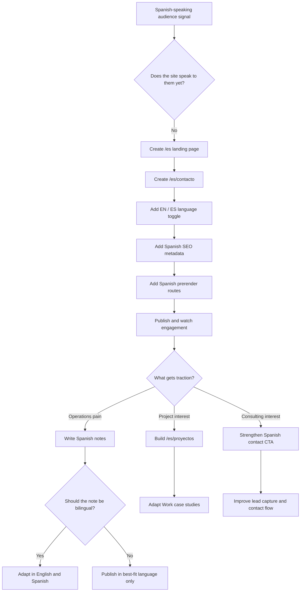

# Spanish Site Strategy: Problem -> Algorithm -> Pseudocode / Flowchart -> Actual Code

This planning document explains how to adapt the h777 site for a Spanish-speaking
audience, especially Mexican real estate investors, developers, property
management teams, brokers, and post-sale operations teams.

Use this before implementation so the Spanish version is not just translated,
but intentionally adapted to the audience.

## 1. Problem

The current h777 site speaks clearly to an English-speaking audience interested
in property management operations, PropTech tools, field notes, and product
case studies.

New audience signal:

- Mexican investment companies building homes are engaging.
- Realtors and real-estate operators are engaging.
- More Spanish-speaking people are finding the work.
- The pain points are related, but the language, examples, and market context
  are different.

The problem:

The site needs a Spanish version that communicates the same h777 voice and
operational clarity, while speaking naturally to Mexican real estate operators,
developers, investors, brokers, and post-sale teams.

This should not be a literal translation. It should be a market-aware Spanish
version.

## 2. Audience

Primary Spanish-speaking audience:

- Desarrolladoras
- Inmobiliarias
- Inversionistas inmobiliarios
- Administradores de propiedades
- Brokers and realtors
- Equipos de mantenimiento
- Equipos de postventa residencial
- Owners with multiple properties
- Small real-estate operators using WhatsApp, Excel, and memory as their system

## 3. Core Spanish Positioning

English positioning:

> Property management operations tools, field notes, workflow experiments, and
> case studies.

Spanish adapted positioning:

> Herramientas y notas para ordenar operaciones inmobiliarias: mantenimiento,
> postventa, evidencia, seguimiento y sistemas internos que ya no caben en
> WhatsApp, Excel y memoria.

Sharper Spanish hero idea:

> Ordenando operaciones inmobiliarias que ya no caben en WhatsApp, Excel y
> memoria.

Supporting copy:

> h777 ayuda a convertir mantenimiento, postventa y seguimiento operativo en
> procesos visibles, trazables y faciles de explicar.

## 4. Algorithm

The algorithm is the rollout plan: how the site moves from English-only to a
credible bilingual system.

1. Keep the English site stable.
2. Add a small Spanish entry point first.
3. Create Spanish routes under `/es`.
4. Add a language toggle in the Navbar.
5. Add Spanish SEO metadata for Spanish pages.
6. Add Spanish prerender support so search engines can read the Spanish pages.
7. Start with the highest-value Spanish pages:
   - `/es`
   - `/es/contacto`
8. Watch engagement from Spanish-speaking visitors.
9. Expand to `/es/proyectos` once the messaging feels right.
10. Adapt case studies into Spanish.
11. Adapt only the Journal notes that make strategic sense.
12. Later, move route/copy data into shared bilingual content objects so future
    publishing becomes easier.

## 5. Phase Checklist

### Phase 1: First Polish

Goal: add a credible Spanish entry point without rebuilding the whole site.

- [ ] Create `/es` Spanish landing page.
- [ ] Create `/es/contacto` Spanish contact page.
- [ ] Add Spanish nav labels.
- [ ] Add a simple language toggle: `EN / ES`.
- [ ] Write Spanish copy for the Mexican real estate operations audience.
- [ ] Add Spanish SEO title and description.
- [ ] Add Spanish routes to the prerender script.
- [ ] Keep English pages unchanged.
- [ ] Do not translate the entire site yet.

Recommended Spanish nav labels:

- Inicio
- Notas
- Laboratorio
- Proyectos
- Acerca
- Contacto

Recommended first CTA:

> Hablemos de tu operacion

Recommended secondary CTA:

> Ver proyectos

### Phase 2: Full Spanish Website Version

Goal: make Spanish feel first-class, not like an afterthought.

- [ ] Add `/es/proyectos`.
- [ ] Add Spanish Work case-study pages:
  - `/es/proyectos/pm-ops-map`
  - `/es/proyectos/techsync-ops`
  - `/es/proyectos/turnflow-home`
- [ ] Add `/es/notas`.
- [ ] Add `/es/laboratorio`.
- [ ] Add `/es/acerca`.
- [ ] Translate or adapt only the most relevant Journal entries first.
- [ ] Add Spanish metadata for every Spanish route.
- [ ] Add `hreflang` support between English and Spanish versions.
- [ ] Add Spanish sitemap entries.
- [ ] Add tests that verify Spanish routes exist and have metadata.

### Phase 3: Make It More Automatic

Goal: make future English/Spanish publishing easier without doubling the work.

- [ ] Create shared route metadata.
- [ ] Store English and Spanish titles/descriptions together.
- [ ] Add helpers for localized paths.
- [ ] Let `Seo.tsx` output alternate language links.
- [ ] Let the prerender script generate English and Spanish route files from
      the same route registry.
- [ ] Add tests for alternate language links.
- [ ] Add tests for missing translations.
- [ ] Create a publishing decision rule:
  - English only
  - Spanish only
  - Bilingual/adapted

### Phase 4: Marketing Workflow

Goal: publish in both languages strategically, without making every post twice.

- [ ] Use English posts for builder, product, software, and portfolio notes.
- [ ] Use Spanish posts for Mexican real estate operations pain.
- [ ] Use bilingual/adapted posts for strong evergreen ideas.
- [ ] Cross-link only when there is a real equivalent.
- [ ] Use Spanish LinkedIn posts for Mexican real estate audiences.
- [ ] Use English LinkedIn posts for PropTech, product, software, and builder
      audiences.
- [ ] Track which language and topic gets replies, saves, profile visits, or
      consulting conversations.

## 6. Pseudocode

```text
START

Keep existing English routes

Create Spanish route group under "/es"

IF visitor opens "/es"
  Show Spanish landing page
  Use Spanish copy for Mexican real estate operations audience
  Set Spanish SEO metadata
ENDIF

IF visitor opens "/es/contacto"
  Show Spanish contact page
  Invite user to talk about operations, maintenance, post-sale, or tracking
  Set Spanish SEO metadata
ENDIF

Add language toggle

IF current page has Spanish version
  EN link points to English equivalent
  ES link points to Spanish equivalent
ELSE
  ES link points to "/es"
ENDIF

During build
  Build English routes
  Build Spanish routes
  Add route-specific metadata
  Add static fallback HTML
END

For future content
  Decide content bucket:
    English only
    Spanish only
    Bilingual/adapted

  IF post is operational and relevant to Mexican real estate audience
    Write or adapt in Spanish
  ENDIF

  IF post has equivalent in other language
    Add cross-link
  ENDIF

END
```

## 7. Flowchart



## 8. Actual Code

This is starter code shape for the future implementation. It is not yet applied
to the app.

### Route Shape

```tsx
// src/app/AppRouter.tsx
<Route path="/" element={<App />} />
<Route path="/contact" element={<Contact />} />

<Route path="/es" element={<SpanishHome />} />
<Route path="/es/contacto" element={<SpanishContact />} />
```

Future expanded Spanish routes:

```tsx
<Route path="/es/proyectos" element={<SpanishWork />} />
<Route path="/es/proyectos/:slug" element={<SpanishWorkCaseStudy />} />
<Route path="/es/notas" element={<SpanishJournal />} />
<Route path="/es/notas/:slug" element={<SpanishJournalEntry />} />
<Route path="/es/laboratorio" element={<SpanishLab />} />
<Route path="/es/acerca" element={<SpanishAbout />} />
```

### Spanish Page Copy Object

```ts
// src/app/data/spanishSiteCopy.ts
export const spanishHomeCopy = {
  seoTitle: "h777 | Operaciones inmobiliarias, mantenimiento y postventa",
  seoDescription:
    "Notas, herramientas y sistemas para ordenar operaciones inmobiliarias, mantenimiento, postventa y seguimiento en Mexico.",
  eyebrow: "h777 en espanol",
  headline:
    "Ordenando operaciones inmobiliarias que ya no caben en WhatsApp, Excel y memoria.",
  intro:
    "Construyo herramientas, notas y sistemas para que mantenimiento, postventa y seguimiento operativo sean visibles, trazables y faciles de explicar.",
  primaryCta: "Hablemos de tu operacion",
  secondaryCta: "Ver proyectos",
};
```

### Spanish Home Page Component

```tsx
// src/app/pages/es/SpanishHome.tsx
import { Link } from "react-router-dom";
import { Seo } from "../../components/Seo";
import { spanishHomeCopy } from "../../data/spanishSiteCopy";

export function SpanishHome() {
  return (
    <main className="min-h-screen px-6 py-28 text-foreground sm:px-8 sm:py-32">
      <Seo
        title={spanishHomeCopy.seoTitle}
        description={spanishHomeCopy.seoDescription}
        path="/es"
        locale="es_MX"
      />

      <section className="mx-auto max-w-5xl space-y-8">
        <p className="text-brand/60 text-sm tracking-widest uppercase">
          {spanishHomeCopy.eyebrow}
        </p>

        <h1 className="text-4xl font-bold leading-tight md:text-6xl">
          {spanishHomeCopy.headline}
        </h1>

        <p className="max-w-3xl text-lg leading-loose text-foreground/70 md:text-xl">
          {spanishHomeCopy.intro}
        </p>

        <div className="flex flex-wrap gap-3">
          <Link to="/es/contacto" className="border border-brand/30 px-4 py-2">
            {spanishHomeCopy.primaryCta}
          </Link>
          <Link to="/work" className="border border-foreground/15 px-4 py-2">
            {spanishHomeCopy.secondaryCta}
          </Link>
        </div>
      </section>
    </main>
  );
}
```

### Language Toggle Shape

```tsx
// src/app/components/LanguageToggle.tsx
import { Link, useLocation } from "react-router-dom";

const spanishRouteMap: Record<string, string> = {
  "/": "/es",
  "/contact": "/es/contacto",
  "/work": "/es/proyectos",
};

const englishRouteMap = Object.fromEntries(
  Object.entries(spanishRouteMap).map(([englishPath, spanishPath]) => [
    spanishPath,
    englishPath,
  ])
);

export function LanguageToggle() {
  const { pathname } = useLocation();
  const spanishPath = spanishRouteMap[pathname] ?? "/es";
  const englishPath = englishRouteMap[pathname] ?? "/";

  return (
    <div className="flex gap-2 font-display text-sm tracking-wide">
      <Link to={englishPath}>EN</Link>
      <Link to={spanishPath}>ES</Link>
    </div>
  );
}
```

### SEO Alternate Language Shape

```tsx
// Future Seo.tsx props
type SeoProps = {
  title: string;
  description: string;
  path: string;
  locale?: "en_US" | "es_MX";
  alternates?: {
    en?: string;
    esMx?: string;
  };
};
```

HTML output goal:

```html
<link rel="alternate" href="https://h777.dev/" hreflang="en" />
<link rel="alternate" href="https://h777.dev/es" hreflang="es-MX" />
<link rel="alternate" href="https://h777.dev/" hreflang="x-default" />
```

### Publishing Decision Code Shape

```ts
type ContentLanguageStrategy = "english-only" | "spanish-only" | "adapted-bilingual";

type PublishingDecision = {
  strategy: ContentLanguageStrategy;
  englishPath?: string;
  spanishPath?: string;
  reason: string;
};

export const publishingRules = {
  useEnglishOnly:
    "Technical build notes, software architecture, and builder reflections.",
  useSpanishOnly:
    "Mexican real estate operations, post-sale, maintenance, WhatsApp/Excel workflows.",
  useAdaptedBilingual:
    "Evergreen operations lessons, strong case studies, and ideas tied to consulting offers.",
};
```

## 9. Marketing Plan

### English Content

Use English for:

- software builder notes
- React/Vite/SEO lessons
- product-building reflections
- PropTech/product audience
- portfolio credibility

### Spanish Content

Use Spanish for:

- inmobiliarias
- desarrolladoras
- inversionistas
- mantenimiento
- postventa
- evidencia
- seguimiento
- WhatsApp/Excel/process chaos

Spanish post ideas:

- "Cuando todo vive en WhatsApp, nadie sabe que esta cerrado"
- "Postventa sin evidencia es una deuda operativa"
- "El problema no siempre es el proveedor; muchas veces es el seguimiento"
- "Tu operacion inmobiliaria no necesita mas mensajes. Necesita trazabilidad"

### Bilingual / Adapted Content

Use adapted bilingual posts for the strongest evergreen ideas.

Example:

- English: "The Silent Killer of Property Management Operations"
- Spanish: "El asesino silencioso de las operaciones inmobiliarias"

Do not translate word-for-word. Adapt the examples, language, and pain points.

### Cross-Linking Rule

For English pages:

```text
Spanish adaptation: [link]
```

For Spanish pages:

```text
Nota relacionada en ingles: [link]
```

Only add cross-links when there is a real equivalent or useful companion.

## 10. Recommended First Implementation

Start with this small version:

- `/es`
- `/es/contacto`
- language toggle
- Spanish SEO metadata
- Spanish prerender support for those two routes

Then watch:

- who clicks
- who replies
- which Spanish phrases get engagement
- whether people ask about postventa, mantenimiento, inversion, administration,
  or process cleanup

That feedback should decide how large the Spanish site becomes.

## 11. Definition Of Done

The first Spanish polish is complete when:

- [ ] `/es` works locally.
- [ ] `/es/contacto` works locally.
- [ ] Navbar includes `EN / ES`.
- [ ] Spanish pages have Spanish metadata.
- [ ] The build prerenders Spanish routes.
- [ ] The visual style still feels like h777.
- [ ] English pages are not broken.
- [ ] `npm run lint` passes.
- [ ] `npm test` passes.
- [ ] `npm run build:check` passes.

