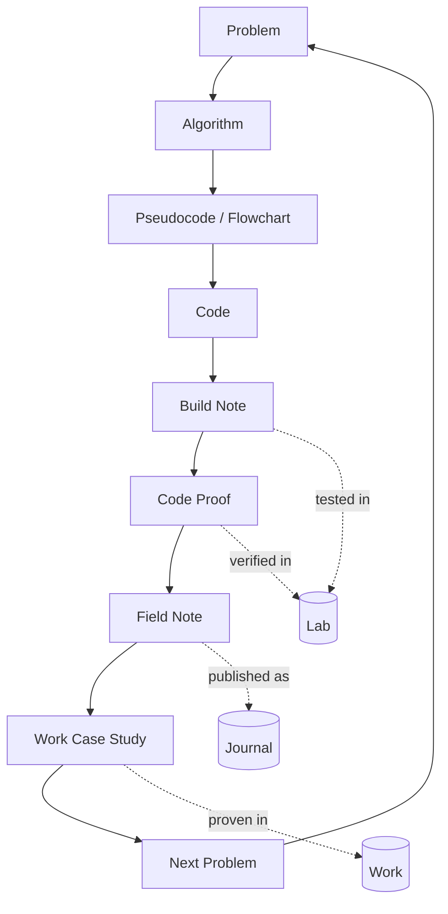

# Software Process Content Loop

## Core Loop

**Problem -> Algorithm -> Pseudocode / Flowchart -> Code**

This is the engineering loop. It keeps the work honest because each step has to explain the step before it.

The content system branches from that same loop:

**Build Note -> Code Proof -> Field Note -> Work Case Study**

That means the public story is not separate from the software. The story comes from the way the software was reasoned, built, tested, and proven.

Standing rule from now on:

**Every meaningful build should have pseudocode and a flowchart before or alongside the code.**

They help expose the logic before the UI, implementation, or story gets too noisy.

## Website Loop

The website already has the right shape for this:

**Journal -> Lab -> Work**

- **Journal** explains the question and the lesson.
- **Lab** tests the idea, model, workflow, build note, or code proof.
- **Work** proves the tool or case study after it earns a clearer shape.

Lab is not the end of the road. Lab is where the idea gets pressure-tested before it becomes Work.

The deeper loop underneath it is:

```text
Problem
  -> Algorithm
    -> Pseudocode / Flowchart
      -> Code
        -> Build Note
          -> Code Proof
            -> Field Note
              -> Work Case Study
                -> Next Problem
```

## Flowchart



Read the dotted lines as shelves, not stopping points:

- **Journal** holds the Field Note.
- **Lab** holds the build note, experiment, flowchart, and code proof while the idea is still being tested.
- **Work** holds the polished case study once the tool or workflow has enough proof.

The main loop still runs through Work Case Study and then into the next problem.

## Pseudocode

```text
For every build, feature, field note, or product idea:

1. Define the Problem.
   Ask what is broken, repeated, hidden, slow, risky, or hard to explain.

2. Translate the Problem into an Algorithm.
   Identify the inputs, states, decisions, handoffs, outputs, and proof.

3. Write Pseudocode or a Flowchart.
   Make the process visible before turning it into code.

4. Check the Pseudocode and Flowchart.
   Confirm the logic is understandable before implementation begins.

5. Build the Code.
   Implement the smallest useful version of the algorithm.

6. Write the Build Note.
   Record what changed, why it changed, and what operational problem it answers.

7. Capture Code Proof.
   Use tests, screenshots, logs, generated routes, SEO checks, or working demos.

8. Write the Field Note.
   Explain the human lesson behind the build.

9. Promote the strongest proof into a Work Case Study.
   Show the tool, the problem, the workflow, and the result.

10. Extract the Next Problem.
   Every conclusion should reveal the next useful question.
```

## How Each Layer Answers The Same Question

### Problem

The real-world friction.

Example:

> Teams keep asking for more people, but work still gets stuck because nobody can quickly find where tasks stand.

### Algorithm

The operating logic underneath the friction.

Example:

> Every task runs on four clocks: doing, finding, waiting, and re-explaining.

### Pseudocode / Flowchart

The process before it becomes software.

Example:

```text
When an invite changes state:
  record the actor
  record the action
  record the timestamp
  record the previous state
  record the new state
  expose the latest state to the workspace
```

### Code

The implemented answer.

Example:

> The app writes invite sent, resent, canceled, accepted, and claimed events into the decision log.

### Build Note

The technical receipt.

Example:

> Added automatic invite decision-log events so the system remembers invite movement without a coordinator reconstructing the trail from chat.

### Code Proof

The evidence that the code did what the note claims.

Example:

> Tests pass, generated logs show the state transitions, and the UI lands the invited user in the correct workspace.

### Field Note

The human story.

Example:

> Do not hire another laptop. Fix the lockfile.

### Work Case Study

The polished proof.

Example:

> TechSync Ops reduces maintenance handoff confusion by making invites, ownership, status, and proof visible across the workflow.

## Creative Questions To Spark The Loop

Use these when a build, post, or product idea feels blurry:

1. What problem keeps repeating?
2. What would break if the main person was unavailable?
3. What is the hidden algorithm under this mess?
4. What are the inputs, states, outputs, and proof?
5. What would the pseudocode say before any UI exists?
6. What did the code make visible?
7. What did the tests or logs prove?
8. What human lesson does this build teach?
9. Which website shelf does it belong on: Journal, Lab, or Work?
10. What is the next problem this conclusion reveals?

## Build Template

Use this small template before each serious build:

```text
Problem:
What is broken, hidden, repeated, or hard to explain?

Algorithm:
What are the steps, states, decisions, handoffs, and proof?

Pseudocode:
Write the logic in plain language before touching the UI.

Flowchart:
Draw the movement from start -> decision -> action -> proof -> next state.

Code:
Build the smallest useful version.

Build Note:
What changed and why?

Code Proof:
What test, screenshot, log, route, or demo proves it?

Field Note:
What human lesson does this reveal?

Work Case Study:
If this is strong enough, how does it become proof on the Work page?

Next Problem:
What new question did this answer expose?
```

## The Rule

If a Field Note cannot point back to a problem, algorithm, pseudocode, build note, or code proof, it may still be a good essay.

But if it can point back to all of them, it becomes part of the product system.

That is the stronger lane:

**The Journal explains the thinking. The Lab tests the idea. The Work page proves the tool. The code is the receipt.**
